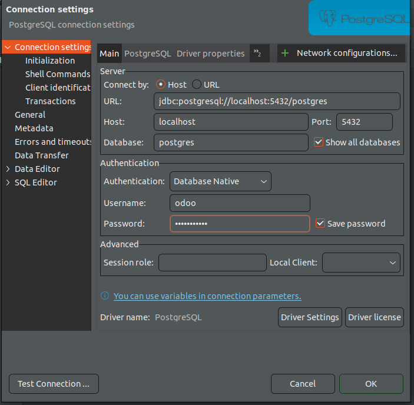
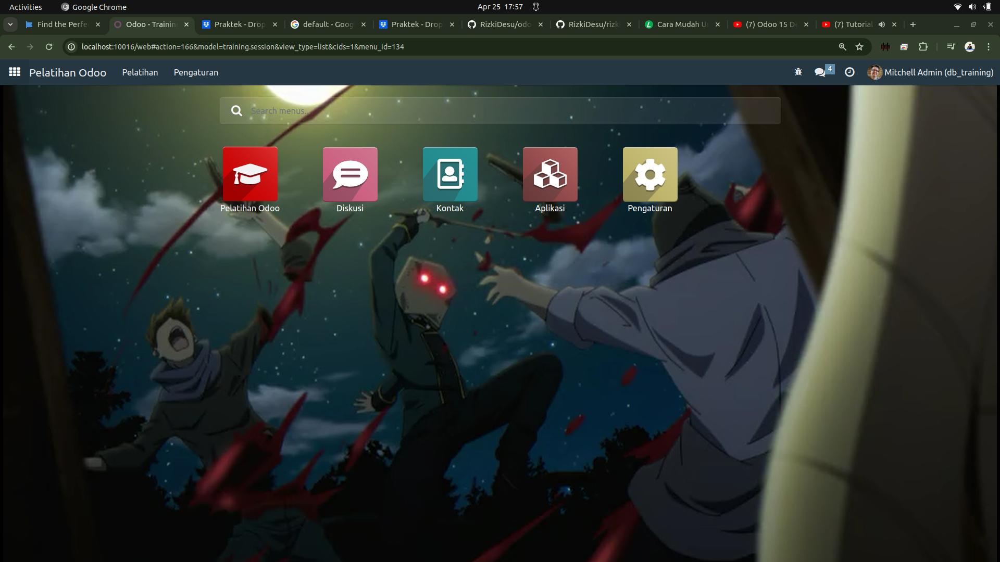

# Odoo CDN Training with docker
* berjalan di linux ubuntu 22.04
* default master pasword odoo`minhng.info`
* managae database `localhost:10016/web/database/selectorweb/database/selector` in login page

## Usage

### CLoning repo

``` bash
git clone https://github.com/RizkiDesu/cdn_odoo_docker.git
```

### Biar bisa akses folder dengan bebas(linux)

- **If you get any permission issues**, change the folder permission to make sure that the container is able to access the directory:

``` sh
sudo chmod -R 777 addons
sudo chmod -R 777 etc
sudo chmod -R 777 postgresql
```

### Start the container:
``` sh
docker-compose up
```

Then open `localhost:10016` to access Odoo 16.0.


## SCAFFOLDING Odoo

``` sh
docker exec -it <nama_kontainer> /usr/bin/odoo scaffold <nama-modul> /mnt/extra-addons
```


## Odoo container management

**Run Odoo**:

``` bash
docker-compose up -d
```

**Restart Odoo**:

``` bash
docker-compose restart
```

**Stop Odoo**:

``` bash
docker-compose down
```

## docker-compose.yml

* odoo:16.0
* postgres:15


## refrensi 
- [odoo mates](https://youtube.com/playlist?list=PLqRRLx0cl0hoZM788LH5M8q7KhiXPyuVU&si=MhywVwnZhOpRHCj4)
- [auto didak](https://youtube.com/playlist?list=PLxnh_lDN7wxenhhZYqYQcB4JRMHtRs-cP&si=LVSFPzDKL2FZ5KWy)


## CDN Ttaining screenshots.




